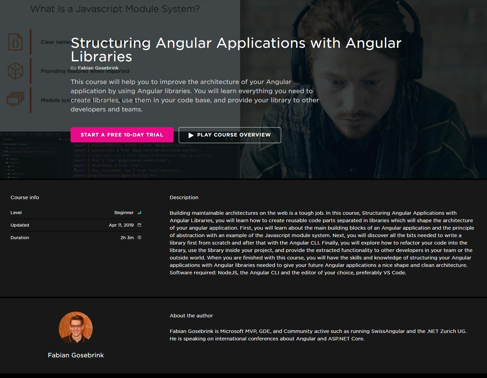

# Structuring Angular Applications with Angular Libraries

This is the repository for my course "Structuring Angular Applications with Angular Libraries" at Pluralsight

## Getting started

### Backend

Please make sure you have installed [.NET Core](https://dotnet.microsoft.com/download). After this you can navigate to the `backend/aspnetcore` folder (for example `m5\angular-cli-app\start\backend\aspnetcore`) at the level of the `Backend.csproj` file and start the webAPI with `dotnet run` on your commandline.

### Frontend

You can start the frontend with `npm start` as it is an angular CLI project like described in the course.

## Course Link

[Structuring Angular Applications with Angular Libraries](https://app.pluralsight.com/library/courses/structuring-angular-applications-angular-libraries)

Have fun!